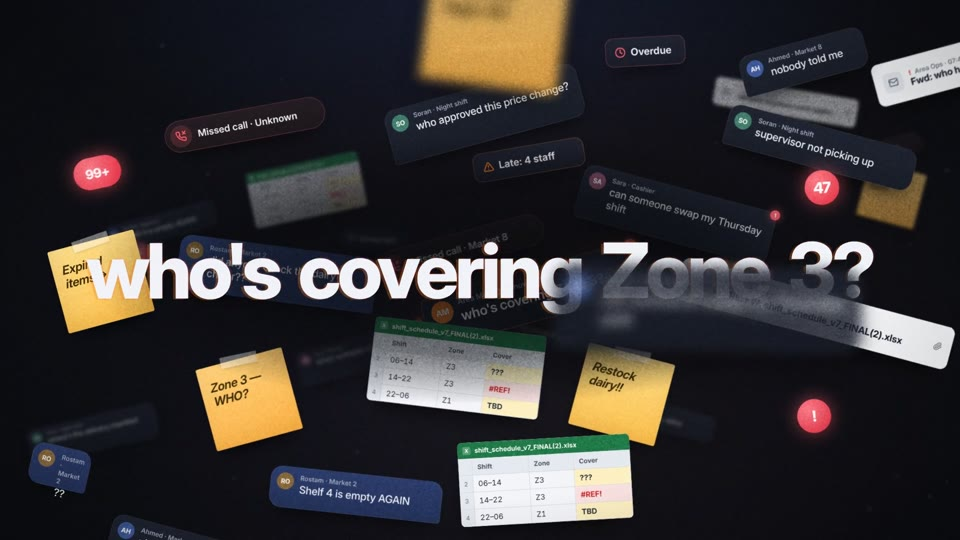
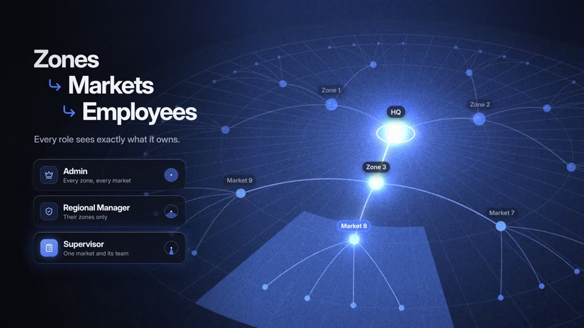
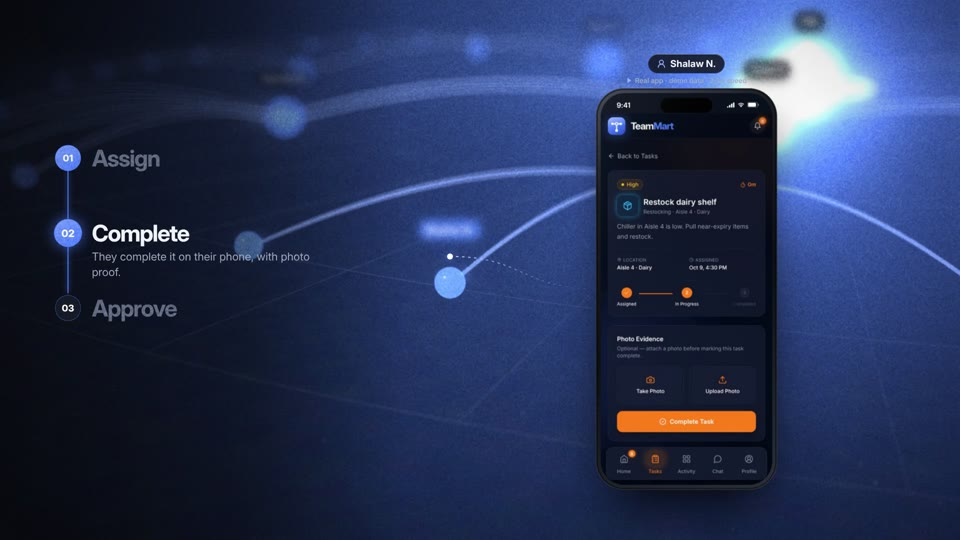
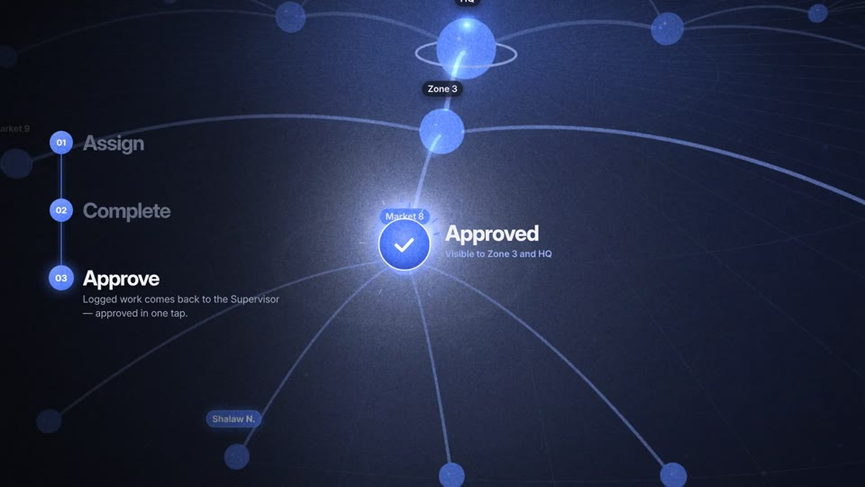
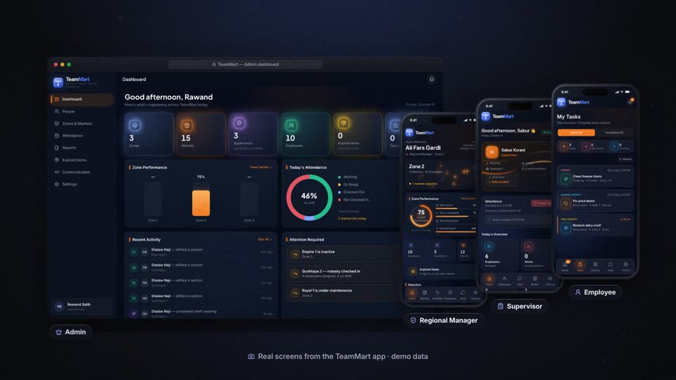
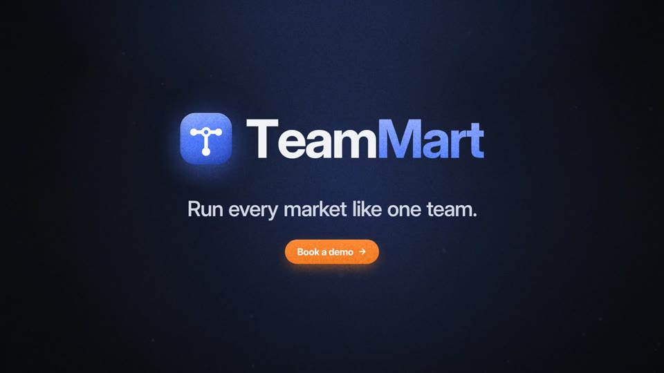

# TeamMart — promo film (Remotion)

A motion-graphic film for **TeamMart**, built in [Remotion](https://www.remotion.dev) (React +
three.js): a 40 s master, 15 s and 6 s cutdowns, in 16:9, 9:16 and 1:1, in English and Sorani
Kurdish, personalisable per prospect, with an original score and sound design.

No stock footage and no mock-ups of the product: every app screen in the film is the **real
TeamMart app**, either a screenshot or a screen recording driven by a script against the running
app with its demo data.

**Story:** chaos → freeze → *"What if every market ran like one team?"* → a 3D Zone → Market →
Employee hierarchy where each role's scope lights up → one task's real round trip (Supervisor
assigns → employee completes with a photo → Supervisor approves) → a live dashboard → the real
product → logo, tagline, call to action. Shot-by-shot plan: **[PLAN.md](PLAN.md)**.

| | | |
|---|---|---|
|  **0:05** chaos |  **0:14** 3D hierarchy, role scopes |  **0:21** real app, recorded |
|  **0:26** approved |  **0:34** real product |  **0:38** close |

### What's new in v2

1. **Original score + sound design, mixed to picture.** 120 BPM, every cut on the beat grid;
   ~135 synthesised cues placed from the picture's own beat sheet (taps inside the phones land on
   the recorded taps); a separate arrangement per edit; −14 LUFS. → [Soundtrack](#soundtrack)
2. **Real 3D hierarchy.** three.js via `@remotion/three`: perspective camera flights, lighting,
   true sub-frame motion blur, bloom and depth of field. → [3D](#the-3d-hierarchy)
3. **The real workflow.** The phones play screen recordings of the actual app flow, and the step
   copy now says exactly what the product does. → [Recordings](#real-app-recordings-and-screenshots)
4. **Per-prospect versions + Kurdish.** Props for company, zones, markets and names; a full Sorani
   Kurdish (RTL) version. → [Personalise](#personalise-for-a-prospect)
5. **Final logo, one palette, every format.** A brand kit shared with the app (blue = identity,
   orange = action), 15 s / 6 s cutdowns, square format, burned-in captions + SRT/VTT.
   → [`../brand/`](../brand/README.md)

---

## Compositions

| Folder | Composition ids | Sizes | Length |
|---|---|---|---|
| Master-40s | `TeamMartPromo`, `…Vertical`, `…Square` | 1920×1080 · 1080×1920 · 1080×1080 | 40 s (2,400 f) |
| Social-15s | `TeamMart15`, `…Vertical`, `…Square` | same | 15 s (900 f) |
| Social-6s | `TeamMart6`, `…Vertical`, `…Square` | same | 6 s (360 f) |
| Kurdish | `TeamMartPromoKurdish`, `…Vertical`, `…Square` | same | 40 s |

All run at 60 fps. Every composition takes the same props (language, captions, prospect), so any
cut can be rendered in Kurdish or for a prospect.

## Install

Requires Node 22+ (the soundtrack and caption scripts run TypeScript directly) and ffmpeg.

```bash
cd promo
npm install
```

The first render downloads Remotion's headless Chrome. On a locked-down network, point it at an
installed Chrome/Chromium instead:

```bash
export REMOTION_BROWSER_EXECUTABLE=/path/to/chrome   # optional
```

## Preview

```bash
npm run dev          # Remotion Studio: every composition, editable props panel
npm run stills                                     # key frames of the 16:9 master → out/stills/
npm run stills -- TeamMartPromo@600,1300 TeamMart15Square@420   # any compositions/frames
```

## Render

```bash
npm run render:all                    # all 12 deliverables → out/*.mp4
npm run render:all -- TeamMart15      # only ids starting with TeamMart15 (add $ for an exact id)
npm run render                        # just the 16:9 master
npx remotion render TeamMart6Vertical out/6s.mp4 --props='{"lang":"ckb","captions":true,"prospect":…}'
```

`render:all` uses one bundle and one browser for everything (H.264 CRF 18 + AAC 256 kb/s).
Timing on a 4-core machine with no GPU: about 35 min for a 40 s master, 10 min for a 15 s cut,
2 min for a 6 s cut — the 3D section dominates (see [Performance](#performance)).

---

## Personalise for a prospect

Everything about the org is a prop, validated by a zod schema (`src/props.ts`), so the Studio
shows a form for it:

```jsonc
// prospects/example-northgate.json
{
  "lang": "en",
  "captions": true,
  "prospect": {
    "company": "Northgate Markets",                    // "Prepared for …" under the CTA
    "zones": [
      { "name": "Erbil North", "markets": ["Sami Abdulrahman", "Ankawa", "Shorsh"] },
      { "name": "Erbil South", "markets": ["Bakhtiari", "Iskan"] },
      …                                                // 2–6 zones, 1–6 markets each
    ],
    "employeesPerMarket": 4,
    "focusZone": 0,          // the Regional Manager's zone, nearest the camera
    "focusMarket": 1,        // the Supervisor's market inside it
    "employee": "Shalaw N."  // who receives the task
  }
}
```

```bash
npm run render:all -- --props=prospects/example-northgate.json --suffix=-northgate TeamMart15
npm run audio -- --prospect prospects/example-northgate.json   # re-time node ticks to that org
```

The prospect's names flow everywhere: the chaos hero line (*"who's covering Erbil North?"*), the
3D hierarchy and its labels, *"Visible to Erbil North and HQ"*, the live dashboard feed, and
*"Prepared for Northgate Markets"* on the close. Empty names fall back to *Zone 1 / Market 3*.

**Kurdish:** `"lang": "ckb"` switches every string to Sorani (`src/i18n/ckb.ts`, following the
app's own glossary), lays the film out right-to-left, uses Noto Sans Arabic, plays the Kurdish
screen recordings and screenshots, and the Kurdish soundtrack mix. Have a native speaker review
the copy before external use, as with the app's locales.

## Soundtrack

```bash
npm run audio      # → public/audio/{full,cut15,cut6}[-ckb].m4a  (+ stems in out/audio-stems/)
```

Nothing is sampled; it's all synthesised in `scripts/audio/` (oscillators, FM bells, filtered
noise, a Freeverb), so there are no licences to clear.

- **Cue sheet** — `src/timeline/cues.ts` builds every cue from the same data the picture uses:
  the chaos cast's entry frames, the 3D beat sheet, the dashboard and close beats, and the taps
  in the screen recordings (from `src/recordings/events.json`). Change timing and the sound moves
  with it.
- **Score** — 120 BPM in D (one beat = 30 frames, so every cut lands on the grid). Chaos: a
  dissonant cluster, quickening heartbeat and ticking hats that tape-stop dead on the freeze. Beat:
  silence, then an airy Dmaj9. Structure: chords arrive with the hierarchy. Workflow and dashboard:
  the groove. Close: one big Dmaj9 and a long tail.
- **Per edit** — the 15 s and 6 s cuts get their own arrangement over their own sections rather
  than a chopped-up master, plus a whoosh on every cut.
- **Mix** — music ducks under the big hits; master limited, then loudness-normalised with ffmpeg
  `loudnorm` (two pass) to −14 LUFS integrated, −1.5 dBTP.

The film plays `public/audio/<edit>-<lang>.m4a` (falling back to `<edit>.m4a`) when it exists;
set `AUDIO.enabled = false` in `config.ts` to render silent.

## Captions

Burned in by default on the social cuts and on 9:16/1:1 masters (prop `captions`). Sidecar files
for players and platforms:

```bash
npm run captions   # → captions/<edit>.<lang>.srt / .vtt
```

## The 3D hierarchy

`src/scenes/graph3d/` — S3 and S4.

| File | Role |
|---|---|
| `beats.ts` | Every beat in master frames (pure; the soundtrack reads it too). |
| `choreo.ts` | The world as a pure function of the frame: camera keyframes, node/edge growth, role scopes, the task packet, ring pulses. Also the camera → screen projection the overlays use. |
| `World.tsx` | three.js scene and render loop: an accumulation pass renders N sub-frames across a 180° shutter (true motion blur, N chosen from on-screen motion), then half-res bloom, depth of field from real scene depth, output. Stateless between frames, so Remotion can render frames in any order, in parallel. |
| `GraphScene.tsx` | `<ThreeCanvas>` composited with `screen` over the film's background, plus DOM labels, phones, leader lines and the approval burst, pinned to nodes through the same camera. |
| `Overlays.tsx` | Headline, role badges with scope pies, the 3-step stepper. |
| `PhoneClip.tsx` | Plays a real recording inside a phone, frame-accurately from master time. |

### Performance

WebGL in headless Chrome falls back to SwiftShader (CPU) on machines without a GPU. Measured on 4
cores: ~0.3 s per DOM frame, ~1.5 s per 3D frame. Knobs in `LOOK` (`config.ts`):
`motionBlurSamples3d` (max sub-frames; each costs ~0.5 s/frame), `scale3d` (internal resolution of
the 3D layer; labels, phones and type stay DOM-sharp), `bloom`. On a GPU machine, set
`scale3d: 1`.

## Real app recordings and screenshots

| What | Files | Made by |
|---|---|---|
| Screen recordings, en + ckb | `public/recordings/<lang>/supervisor-assigns.mp4`, `employee-completes-task.mp4`, `supervisor-approves.mp4` + `src/recordings/events.json` | `npm run record` |
| Screenshots, en + ckb | `public/screens/<lang>/admin-dashboard.png`, `regional-manager-home.png`, `supervisor-home.png`, `employee-tasks.png` | `node scripts/capture-screens.cjs [--lang ckb]` |

Both scripts drive the actual app (this repo's `Frontend/` + `backend/`, run locally with the
seed's demo accounts — see the root README), with Playwright:

```bash
npm i --no-save playwright@1.56.1
npm run record                              # the three flows, English then Kurdish
node scripts/capture-screens.cjs            # screenshots (add --lang ckb for Kurdish)
```

`record-flows.cjs` assigns a task, completes it with a photo and approves a logged activity
**through the UI**, screencasting at device resolution and retiming to 60 fps; taps show as a soft
ripple. It writes the moment of each tap to `events.json`, and the film cuts the clips around those
moments (`src/recordings/clips.ts`) and fits them to their slot — so a re-recording drops straight
in. It writes to the database the API points at, and switches the demo accounts' language for the
Kurdish run (and back): only use it against a local or demo instance.

What the film claims matches the app: Supervisors assign sudden tasks (`EmployeeTasksSection`);
employees start and complete them with photo evidence (`SuddenTaskDetailScreen`); logged work goes
to the Supervisor's Review Queue (`ReviewQueueScreen`), where it's approved. Dashboard figures are
**sample values**, and the panel always says *Illustrative data*.

---

## Edit colors, copy and timing — `src/config.ts`

| Block | Controls |
|---|---|
| `COLORS` | From `../brand/tokens.mjs`: blue for identity/data, orange for action/alerts. `COLORS.app` holds the app's own tokens for UI drawn in the film. |
| `DEFAULT_PROSPECT` | The org shown when no prospect is given. |
| `COPY` | Every English word on screen, including captions (Kurdish: `src/i18n/ckb.ts`). `{zone}`, `{market}`, `{employee}`, `{company}` are filled from the prospect. |
| `SCREENS` | Which screenshot/recording appears where (`{lang}` is filled per language). |
| `TIMING.scenes` | Seconds per scene (6 / 3 / 7 / 11 / 8 / 5 = 40 s). Beats scale with it; so do the sound cues. |
| `LOOK` | Grain, vignette, motion blur, shutter angle, 3D samples/scale/bloom. |
| `AUDIO` | Soundtrack on/off, master volume. |

Cutdowns are edit decision lists over the master — `src/timeline/edits.ts` (shots with a speed,
on the beat grid); their captions are in `COPY.captions`.

## How one composition makes every format

Each scene reads `useLayout()` (`landscape` / `portrait` / `square`) and `useLang()` and adapts —
see PLAN.md for the per-format changes. Each edit maps output frames to fractional master frames
(`src/timeline/edits.ts` → `FilmTimeProvider`); scenes animate on master time and use the frame
step for motion blur, so sped-up shots blur correctly.

## Motion system

| Technique | Where |
|---|---|
| **spring() + interpolate() only** | `src/lib/motion.ts` — five spring presets tuned for fast attack and slight overshoot. |
| **Unique stagger** | `stagger()` adds a golden-ratio sub-frame offset so no two elements start on the same frame. |
| **Directional motion blur (DOM)** | `src/components/MotionBlur.tsx` — rotate into the direction of travel, one-axis Gaussian blur, rotate back; length = velocity × 180° shutter. |
| **Motion blur (3D)** | Sub-frame accumulation across the shutter in `World.tsx`. |
| **Depth of field** | 3D: from scene depth (BokehPass), racked so the world drops out of focus while a phone is up. DOM: per-layer blur. |
| **Deterministic physics** | `src/scenes/chaos/sim.ts` — precomputed, seeded chaos simulation; any frame renders in isolation. |
| **Grain, glow, glass** | Animated grain tiles, radial glows, glass cards with a gradient 1px border. |

## Project structure

```
promo/
  PLAN.md                       shot-by-shot plan
  captions/                     SRT/VTT per edit and language
  prospects/                    example prospect props
  public/
    audio/                      generated soundtrack (npm run audio)
    recordings/<lang>/          real app screen recordings (npm run record)
    screens/<lang>/             real app screenshots
    fonts/ grain/
  scripts/
    render-all.mjs              every deliverable, one bundle
    render-stills.mjs           key-frame stills
    record-flows.cjs            drive + screen-record the app
    capture-screens.cjs         app screenshots
    audio/                      synth, score, mixer (npm run audio)
    export-captions.ts
  src/
    config.ts                   colors, copy, prospect, timing, look
    props.ts                    composition props (zod)
    Root.tsx  Film.tsx  Promo.tsx
    i18n/                       Kurdish copy, placeholder filling, language context
    structure/model.ts          the org layout from a prospect
    timeline/                   master clock, edits (cutdowns), sound cue sheet
    recordings/                 recording events + how clips are cut
    lib/  components/
    scenes/
      chaos/  Beat.tsx  graph3d/  dashboard/  Close.tsx
```

## Licensing notes

- **Remotion** is free for individuals and companies of up to 3 people; larger for-profit
  organisations need a [company license](https://www.remotion.pro) to render with it.
- **three.js**, **@react-three/fiber** — MIT. **Lucide** icons — ISC. **zod** — MIT.
- **Inter** and **Noto Sans Arabic** — SIL Open Font License 1.1 (`public/fonts/`).
- The soundtrack is generated by this repo's code; no third-party audio.
